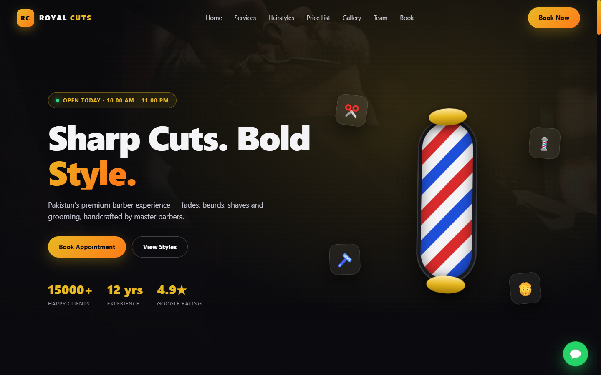
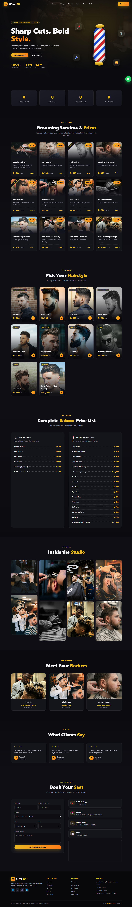
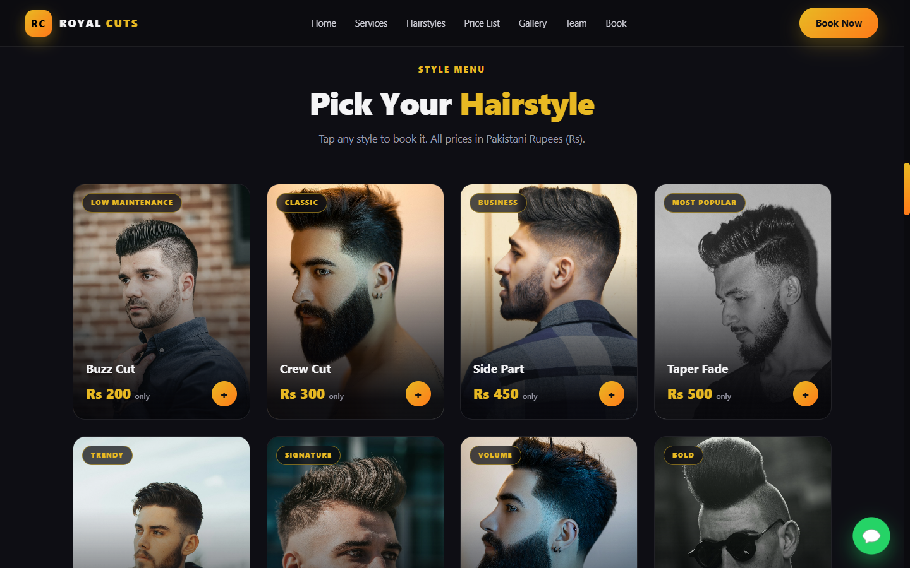
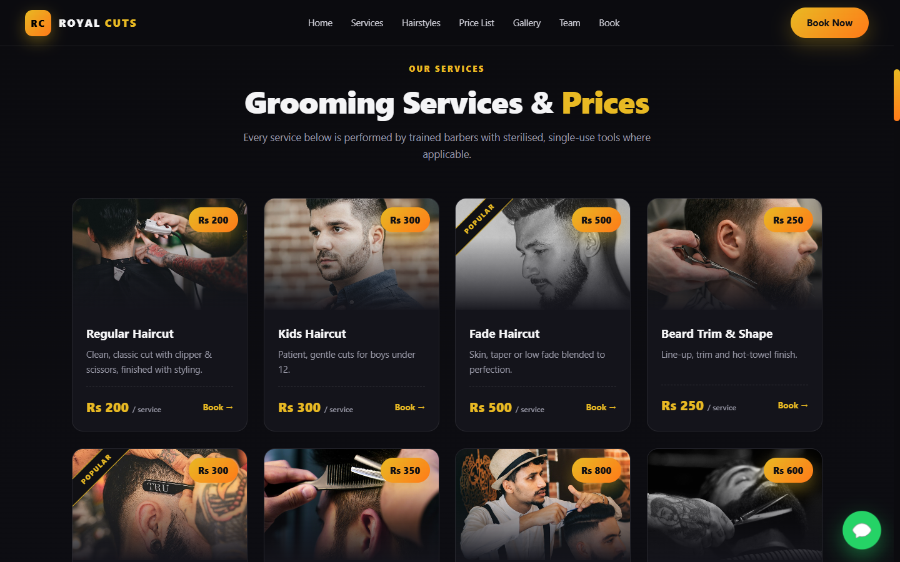
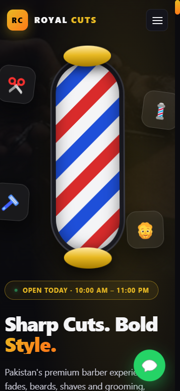
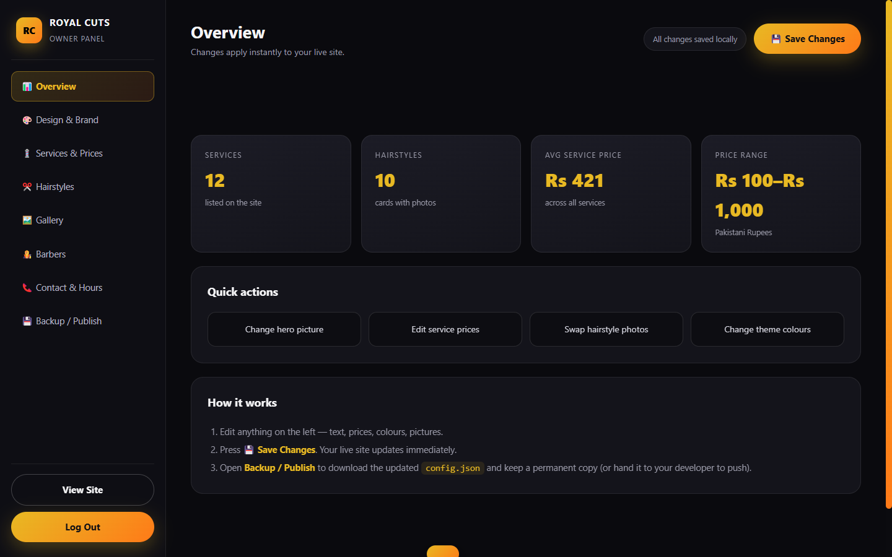

# ✂️ Royal Cuts — Barber & Grooming Studio

Dark-luxury, fully responsive barbershop website with **3D animated design**, PKR price cards, a hairstyle gallery, WhatsApp booking and a **password-protected owner dashboard** so the shop owner can change pictures, prices and design without touching code.

Built by **ZN DEVELOPER** — Zain Hanif.

🔗 **Live site:** https://zainhanif-3.github.io/royal-cuts/
📦 **Repository:** https://github.com/ZainHanif-3/royal-cuts

---

## 🖼️ Screenshots

| Home (hero) | Full page |
|---|---|
|  |  |

| Hairstyles | Services |
|---|---|
|  |  |

| Mobile (360px) | Owner dashboard |
|---|---|
|  |  |

---

## ✨ Features

**Public site**
- Full-screen hero with a **real 3D animated barber pole**, floating tools and mouse parallax
- Interactive **3D tilt cards** — every card follows your cursor with depth + light
- **12 service cards** with photos and PKR prices (Rs 100 – Rs 1000)
- **10 hairstyle cards** with pictures, tags and prices — tap any card to book it
- Complete two-column **saloon price list** (hair, shave, beard, skin, packages)
- Masonry gallery, barber team, testimonials, animated stat counters
- **Booking form → WhatsApp** with pre-filled message
- Embedded map, floating WhatsApp button, fully responsive (360px → 2560px)
- `prefers-reduced-motion` respected, lazy-loaded images, no frameworks

**Owner dashboard (`admin.html`)**
- Password login (default: `royalcuts2026`)
- Change brand name, logo letters, hero text, badge, buttons
- **Swap any picture** — paste a URL or upload a file
- **Edit prices** for every service and hairstyle, add/remove/reorder items
- **Live theme colours** — 4 colour pickers + 6 one-click presets
- Edit contact details, hours, WhatsApp number, map
- KPI overview, save / **export `config.json`** / import / reset
- Change the admin password

---

## 🚀 Run it

```bash
# Option A — any static server
npx serve .            # or: python -m http.server 8080

# Option B — optional Node API (persists owner edits server-side)
npm install
npm start              # http://localhost:3000
```

Then open `http://localhost:3000` — site at `/`, dashboard at `/admin.html`.

---

## 🔑 Admin

| | |
|---|---|
| URL | `/admin.html` |
| Default password | `royalcuts2026` |

**Recommended:** change the password immediately in **Backup / Publish → Admin password**.

### How owner edits become permanent

1. Owner edits in the dashboard → **💾 Save Changes**.
   - With `npm start`: the edit is written to `config.json` through `POST /api/config` → **live for every visitor immediately** (state reads `Saved on the server — live for everyone`).
   - On a static host: the edit applies in that browser, then download **`config.json`** from **Backup / Publish** and drop it in the site root.
2. **Content resolution order:** browser override → `config.json` → `js/config.js` defaults.
3. Server safety: the API refuses bodies over 8 MB and keeps `config.json.bak` with the previous version.

---

## ✅ Verification (run before claiming done)

| Check | Result |
|---|---|
| `node --check server.js` / `js/*.js` | pass |
| `npm start` → `/`, `/admin.html`, `/config.json`, `/api/config` | 200 |
| unknown path `/nope` | 404 |
| Public page console errors | 0 |
| Rendered counts | 12 services, 10 styles, 22 price rows, 8 gallery, 3 team, 3 testimonials, 22 booking options |
| Broken images | 0 |
| Wrong admin password | rejected — `Incorrect password.` |
| Price edit → Save → reload | live site shows updated price |
| Picture change (URL **and** file upload) → Save | live hero updated (data URL stored in `config.json`) |
| Theme colour change | applied instantly, persisted after reload |
| Booking submit (empty) | blocked, no popup |
| Booking submit (filled) | opens `https://wa.me/923001234567?text=…` with all fields |
| Layout at 360×780 | 0px horizontal overflow, burger drawer opens |

---

## 📁 Structure

```
royal-cuts/
├── index.html          # public site
├── admin.html          # owner dashboard
├── config.json         # published content (overrides defaults)
├── css/
│   ├── style.css       # design system + 3D motion
│   └── admin.css       # dashboard styles
├── js/
│   ├── config.js       # default content (data source)
│   ├── main.js         # renderer + 3D animation
│   └── admin.js        # dashboard logic
├── assets/img/         # 20 photographs
├── docs/
│   ├── SRS.md          # Software Requirements Specification
│   └── DESIGN.md       # Design Document
├── screenshots/        # site captures
└── server.js           # optional JSON API for persistence
```

---

## 📄 Documentation

- [`docs/SRS.md`](docs/SRS.md) — functional/non-functional requirements, data model, acceptance criteria
- [`docs/DESIGN.md`](docs/DESIGN.md) — visual system, motion language, layout, accessibility

---

## 🖼️ Credits

Photography from [Unsplash](https://unsplash.com) (Unsplash License — free for commercial use, no permission required).

---

## 📜 License

MIT — free to use for your own barbershop. Replace the photos and contact details with your own.
